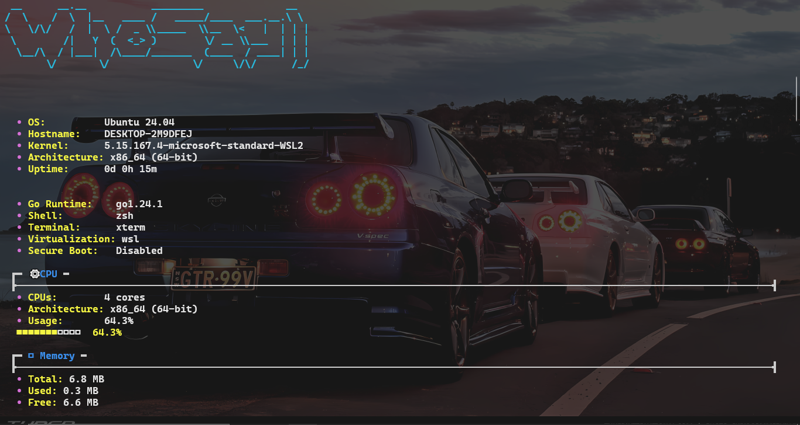
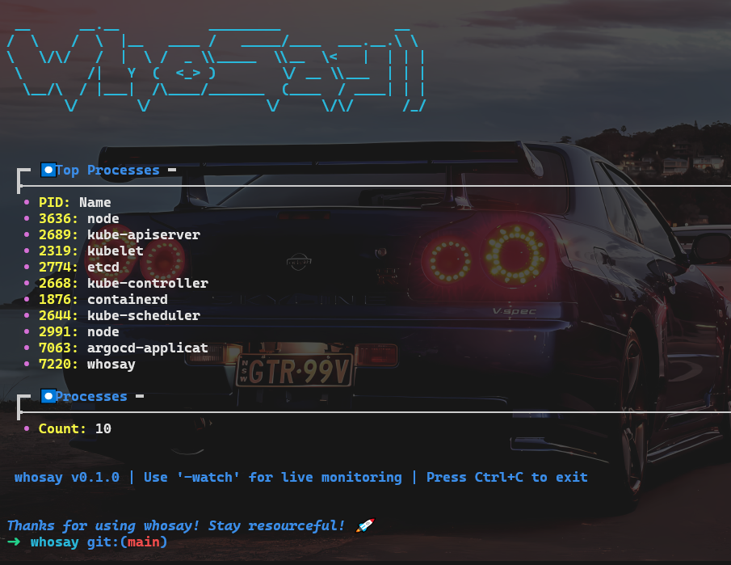

# Whosay - A Developer-Friendly System Monitor


Whosay is a lightweight, easy-to-use system monitoring tool designed specifically for developers. It provides real-time insights into your system's resources with a clean, modern terminal interface.

## Screenshots


*System overview with real-time monitoring of critical resources*


*Process monitoring with color-coded resource usage*

## Features

- **System Overview**: Get detailed information about your operating system, kernel, and hardware
- **Resource Monitoring**: Track CPU, memory, and disk usage in real-time
- **Process Management**: View and monitor running processes sorted by resource usage
- **Network Activity**: Monitor network interfaces and bandwidth usage
- **Docker Integration**: View and inspect running containers with resource metrics
- **Temperature Monitoring**: Keep an eye on CPU and system temperatures
- **Battery Information**: View battery status, health, and estimated time remaining
- **Watch Mode**: Continuous monitoring with automatic refreshing
- **JSON Output**: Export data in JSON format for integration with other tools

## Installation

Whosay can be installed and deployed in multiple ways depending on your needs.

### Method 1: From Source

```bash
# Clone the repository
git clone https://github.com/tiwariParth/whosay.git

# Navigate to the project directory
cd whosay

# Build the binary
go build -o whosay

# Optionally, move to a directory in your PATH
sudo mv whosay /usr/local/bin/
```

### Method 2: Using Docker

```bash
# Pull the latest image
docker pull parthtiwari/whosay:latest

# Run with necessary permissions for system monitoring
docker run -it --pid=host --net=host --privileged parthtiwari/whosay:latest --all
```

### Method 3: Kubernetes Deployment

```bash
# Apply the Kubernetes manifests directly
kubectl apply -f k8s/namespace.yaml
kubectl apply -f k8s/deployment.yaml
kubectl apply -f k8s/service.yaml

# Or deploy with Helm (recommended)
helm upgrade --install whosay ./helm/whosay -f ./helm/whosay/values-dev.yaml --set createNamespace=true
```

### Method 4: Using the Helm Chart Helper Script

First, make the script executable and then run it:

```bash
# Make the script executable
chmod +x scripts/helm-install.sh

# Run the script to clean existing resources and install with Helm
./scripts/helm-install.sh
```

## Usage

Whosay offers various commands to monitor different aspects of your system:

```bash
# Display basic system information
whosay -sys

# Monitor CPU usage
whosay -cpu

# Monitor memory usage
whosay -mem

# Monitor disk usage
whosay -disk

# Monitor network information
whosay -net

# Monitor network traffic
whosay -nettraffic

# View process information
whosay -proc

# View docker containers
whosay -docker

# Monitor container logs (specify container name or ID)
whosay -container-logs <container-name>

# Display battery status (on laptops)
whosay -battery

# Monitor temperature sensors
whosay -temp

# View system logs
whosay -logs

# Show all information
whosay -all

# Enable continuous monitoring with watch mode
whosay -all -watch

# Set refresh rate for watch mode (in seconds)
whosay -all -watch -refresh 2
```

### Output Options

```bash
# Get JSON output instead of text display
whosay -cpu -json

# Show more detailed information
whosay -cpu -verbose

# Disable colors in output
whosay -cpu -no-color
```

## DevOps Features

Whosay includes a comprehensive DevOps pipeline for continuous integration, continuous delivery, and deployment:

### 1. Continuous Integration

- **GitHub Actions** automatically builds and tests the application on multiple platforms
- Run locally with `go test ./...` or view CI status on the GitHub repository

### 2. Continuous Delivery

- Uses Docker for containerization
- Automatically builds and pushes Docker images to Docker Hub
- Tagged versions create specific image tags

### 3. Kubernetes Deployment

- Kubernetes manifests in `k8s/` directory
- Helm charts in `helm/whosay/` directory

### 4. GitOps with ArgoCD

- Automatic deployment to Kubernetes using ArgoCD
- Syncs with Git repository for declarative configuration

### 5. Helm Chart Deployment

Whosay includes a Helm chart for easy deployment to Kubernetes:

```bash
# Install with default values
helm upgrade --install whosay ./helm/whosay --set createNamespace=true

# Install with environment-specific values
helm upgrade --install whosay ./helm/whosay -f ./helm/whosay/values-dev.yaml --set createNamespace=true
helm upgrade --install whosay ./helm/whosay -f ./helm/whosay/values-prod.yaml --set createNamespace=true
```

## Example Output

When you run Whosay, you'll see a beautifully formatted terminal UI that looks something like this:

```
 ━━━━━━━━━━━━━━━━━━━━━━━━━━━━━━━━━━━━━━━━━━━━━━━━
 │ ℹ System │
 ┣───────────────────────────────────────────────┫
 │  OS:        Ubuntu 22.04                      │
 │  Hostname:  dev-machine                       │
 │  Kernel:    5.15.0-67-generic                 │
 │  Uptime:    2d 3h 45m                         │
 ━━━━━━━━━━━━━━━━━━━━━━━━━━━━━━━━━━━━━━━━━━━━━━━━

 ━━━━━━━━━━━━━━━━━━━━━━━━━━━━━━━━━━━━━━━━━━━━━━━━
 │ ⚙ CPU │
 ┣───────────────────────────────────────────────┫
 │  CPUs:           8 cores                      │
 │  Architecture:   x86_64 (64-bit)              │
 │  Usage:          32.5%                        │
 │                  ■■■■■□□□□□□□□□□□ 32.5%       │
 ━━━━━━━━━━━━━━━━━━━━━━━━━━━━━━━━━━━━━━━━━━━━━━━━
```

## Understanding the Output

- **System Section**: Shows your OS details, hostname, and kernel version
- **CPU Section**: Displays core count, architecture, and current usage
- **Memory Section**: Shows total, used, and free memory with usage bar
- **Disk Section**: Indicates storage capacity and usage for your file systems
- **Process Section**: Lists the top processes consuming resources
- **Network Section**: Shows interface details and current connectivity
- **Docker Section**: Lists running containers with their resource usage

## Color Coding

Whosay uses color to help you quickly understand the state of your system:

- **Green**: Normal resource usage (0-60%)
- **Yellow**: Moderate resource usage (60-85%)
- **Red**: High resource usage (85-100%)

## Docker Container Monitoring

Monitor your Docker containers without switching tools:

```bash
# Get general Docker information
whosay -docker

# Monitor logs from a specific container
whosay -container-logs nginx -logs-limit 50
```

## Advanced Features

### Resource Usage Trends

When using watch mode, Whosay can show resource usage over time:

```bash
whosay -cpu -mem -nettraffic -watch
```

### System Temperature Monitoring

Keep your system's health in check by monitoring temperatures:

```bash
whosay -temp -watch
```

## Compatibility

Whosay works on:

- Linux (Ubuntu, Debian, Fedora, etc.)
- macOS
- Windows 
- WSL (Windows Subsystem for Linux)

## Contributing

Contributions are welcome! Feel free to open issues or submit pull requests on GitHub.
---

_"Stay resourceful with Whosay!" 🚀_
